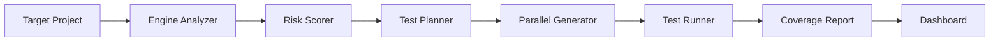

# TestForge 🔬

> AI-powered intelligent test generation and coverage maximization tool  
> Built for the **IBM Bob 2.0 Hackathon**

[](LICENSE)
[](https://nodejs.org)

---

## Overview

**TestForge** analyzes your project's existing test coverage, identifies the highest-risk untested code paths using cyclomatic complexity and import frequency scoring, and automatically generates Jest test files to maximize coverage — all surfaced through an interactive web dashboard.

---

## Architecture



---

## Project Structure

```
testforge/
├── engine/          # Node.js CLI (TypeScript) — testforge binary
├── dashboard/       # React + Vite web UI
├── sample-app/      # Demo Express API (~30% coverage target)
├── docs/            # Session reports and documentation
└── bob_sessions/    # Bob task session screenshots
```

---

## Tech Stack

| Layer | Technology |
|---|---|
| CLI Engine | Node.js 20, TypeScript, Commander, chalk, nyc/Istanbul |
| Test Generation | Jest programmatic API, ts-jest |
| Dashboard | React 18, Vite, Tailwind CSS, Recharts |
| API State | TanStack React Query |
| Sample App | Express, Jest, supertest, nyc |
| Containerization | Docker Compose |

---

## Quick Start

### Prerequisites

- Node.js >= 20
- npm >= 10

### Install

```bash
npm install
```

### Run the Dashboard (standalone demo)

```bash
make dev-dashboard
# Open http://localhost:5173
```

### Analyze the Sample App

```bash
make dev-sample-app   # start sample app + generate coverage
make analyze          # run testforge analyze
make generate         # generate missing tests
make report           # output markdown coverage report
```

### Run All Tests

```bash
make test
```

### Docker

```bash
make docker-up        # start all services
make docker-down      # stop all services
```

---

## Dashboard Views

| Page | Description |
|---|---|
| **Dashboard** | Summary cards + coverage trend line chart |
| **Coverage Map** | Treemap heatmap — red < 30%, yellow 30–70%, green > 70% |
| **Test Generation** | Risk-prioritized list with Generate Tests button + live progress |
| **Reports** | Before/after diff view + markdown export |

---

## Screenshots

> _Screenshots to be added after first demo run._

---

## Team

> _Team info placeholder — update before submission._

---

## Hackathon Context

This project was built during the **IBM Bob 2.0 Hackathon**. Bob (IBM's AI coding assistant) was used to scaffold, implement, and iterate on TestForge across multiple sessions. Session reports are in [`docs/`](docs/).

---

## License

MIT © TestForge Contributors
