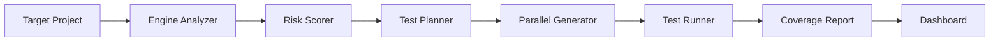

# TestForge 🔬

> AI-powered intelligent test generation and coverage maximization tool  
> Built for the **IBM Bob 2.0 Hackathon**

[](LICENSE)
[](https://nodejs.org)

---

## Overview

**TestForge** analyzes your project's existing test coverage, identifies the highest-risk untested code paths using cyclomatic complexity and import frequency scoring, and automatically generates Jest test files to maximize coverage — all surfaced through an interactive web dashboard.

---

## Architecture



---

## Project Structure

```
testforge/
├── engine/          # Node.js CLI (TypeScript) — testforge binary
├── dashboard/       # React + Vite web UI
├── sample-app/      # Demo Express API (~30% coverage target)
├── docs/            # Session reports and documentation
└── bob_sessions/    # Bob task session screenshots
```

---

## Tech Stack

| Layer | Technology |
|---|---|
| CLI Engine | Node.js 20, TypeScript, Commander, chalk, nyc/Istanbul |
| Test Generation | Jest programmatic API, ts-jest |
| Dashboard | React 18, Vite, Tailwind CSS, Recharts |
| API State | TanStack React Query |
| Sample App | Express, Jest, supertest, nyc |
| Containerization | Docker Compose |

---

## Quick Start

### Prerequisites

- Node.js >= 20
- npm >= 10

### Install & Build

```bash
npm install          # install all workspace deps
npm run build        # compile engine TypeScript → engine/dist/
```

### Run the Engine API

```bash
npm run server       # start engine API on http://localhost:4001
```

### Run the Dashboard

```bash
npm run dev          # start Vite dashboard on http://localhost:5173
```

### Run the Full Pipeline

```bash
# POST to the engine API (engine must be running):
curl -X POST http://localhost:4001/pipeline \
  -H 'Content-Type: application/json' \
  -d '{"projectPath":"./sample-app"}'
```

Or via Make:

```bash
make dev-sample-app   # start sample app + generate coverage baseline
make analyze          # run testforge analyze
make generate         # generate AI-powered tests (BOB_API_KEY required)
make report           # output markdown coverage report
```

### Run All Tests

```bash
make test
```

### Docker

```bash
make docker-up        # start all services
make docker-down      # stop all services
```

---

## Dashboard Views

| Page | Description |
|---|---|
| **Dashboard** | Summary cards + coverage trend line chart |
| **Coverage Map** | Treemap heatmap — red < 30%, yellow 30–70%, green > 70% |
| **Test Generation** | Risk-prioritized list with Generate Tests button + live progress |
| **Reports** | Before/after diff view + markdown export |

---

## Results

**+73.3% function coverage** on the sample Express API — 10% → 83.3% functions covered, driven by AI-generated Jest test files.

| Metric | Before | After | Delta |
|---|---|---|---|
| Statements | 40.9% | 75.0% | **+34.1%** |
| Branches | 4.1% | 37.8% | **+33.7%** |
| Functions | 10.0% | 83.3% | **+73.3%** |
| Files improved | — | 6/6 | — |
| Functions covered | — | 22 new | — |

---

## Team

Built by **Dhriti Manoj** for the IBM Bob 2.0 Hackathon.
Bob (IBM's AI coding assistant) was used as the primary pair-programmer across all sessions — from engine scaffolding to AI test generation integration.

---

## Hackathon Context

This project was built during the **IBM Bob 2.0 Hackathon**. Session reports documenting each build session are in [`docs/`](docs/).

---

## License

MIT © TestForge Contributors
