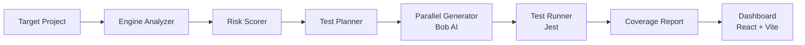
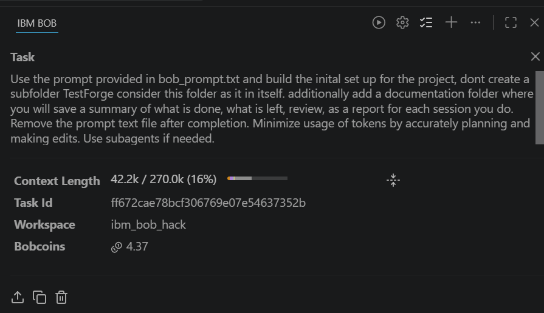
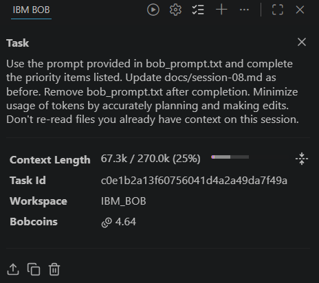

# TestForge 🔬

> AI-powered intelligent test generation and coverage maximization tool  
> Built for the **IBM Bob 2.0 Hackathon** by **Team Glitch**

[](LICENSE)
[](https://nodejs.org)

---

## Team Glitch

| Name | GitHub |
|---|---|
| Dhriti Kamani | [@dhriti445](https://github.com/dhriti445) |
| Diya Agarwal | [@diya-122](https://github.com/diya-122) |
| Monisha Sharma | [@mona309](https://github.com/mona309) |

> Bob (IBM's AI coding assistant) was used as the **primary pair-programmer** across all 9 sessions — from initial project scaffolding to AI test generation, pipeline wiring, dashboard UI, and TypeScript fixes.

---

## Overview

**TestForge** analyzes your project's existing test coverage, identifies the highest-risk untested code paths using cyclomatic complexity and import-frequency scoring, and automatically generates Jest test files to maximize coverage — all surfaced through an interactive web dashboard.

Give it a Node.js project → it returns fully passing, AI-written tests and a before/after coverage report.

---

## Architecture



---

## Project Structure

```
testforge/
├── engine/                  # Node.js API server + pipeline (TypeScript)
│   ├── src/
│   │   ├── analyzer/        # CoverageParser, ProjectScanner, RiskScorer
│   │   ├── generator/       # BobTestWriter, TestPlanner, ParallelOrchestrator
│   │   ├── pipeline/        # Full end-to-end pipeline runner
│   │   ├── reporter/        # CoverageDiff, MarkdownReporter
│   │   ├── runner/          # TestRunner (Jest)
│   │   └── server.ts        # Express API (port 4001)
│   └── .env.example         # BOB_API_KEY template
├── dashboard/               # React 18 + Vite web UI (port 5173)
│   └── src/
│       ├── pages/           # Dashboard, CoverageMap, TestGeneration, Reports
│       ├── hooks/           # useReport, useCoverageData (React Query)
│       └── components/      # RiskTable, CoverageBadge, DiffViewer, Heatmap
├── sample-app/              # Demo Express API — the pipeline's target project
├── docs/                    # Session reports (session-01 → session-09)
└── bob_sessions/            # Bob task screenshots (all 9 sessions)
```

---

## Tech Stack

| Layer | Technology |
|---|---|
| CLI Engine | Node.js 20, TypeScript, Express |
| Coverage Analysis | nyc / Istanbul, Jest programmatic API |
| Test Generation | IBM Bob AI (`bob run`), static fallback |
| Dashboard | React 18, Vite, Tailwind CSS, Recharts |
| API State | TanStack React Query |
| Sample App | Express, Jest, supertest, nyc |
| Containerization | Docker Compose |

---

## Results

**+90 pp function coverage** on the sample Express API — 10% → **100%** — driven entirely by Bob-generated Jest test files.

| Metric | Before | After | Δ |
|---|---|---|---|
| Statements | 40.9% | **100.0%** | **+59.1 pp** |
| Branches | 4.1% | **100.0%** | **+95.9 pp** |
| Functions | 10.0% | **100.0%** | **+90.0 pp** |
| Tests passing | 3 (hand-written) | **124** (121 generated + 3) | — |
| Files generated | — | **6 / 6** via Bob API | — |
| Bob API cost | — | **~0.878 Bobcoins** | — |

---

## How to Run / Replicate

### Prerequisites

- **Node.js >= 20** and **npm >= 10**
- An **IBM Bob API key** (required for AI test generation)

### 1 — Clone and install

```bash
git clone https://github.com/mona309/ibm_bob_hack.git
cd ibm_bob_hack
npm install          # installs all workspace deps (engine + dashboard + sample-app)
```

### 2 — Set your Bob API key

```bash
cp engine/.env.example engine/.env
# Edit engine/.env and set:  BOB_API_KEY=<your-key>
```

### 3 — Build the engine

```bash
npm run build        # compiles engine TypeScript → engine/dist/
```

### 4 — Start the engine API server

```bash
# Terminal 1
node engine/dist/server.js
# API is now listening on http://localhost:4001
```

### 5 — Start the dashboard

```bash
# Terminal 2
npm run dev:dashboard
# Dashboard is now at http://localhost:5173
```

### 6 — Run the full pipeline

**Option A — via the dashboard UI**

Open [http://localhost:5173](http://localhost:5173) → go to **Test Generation** → click **⚡ Generate Tests**.

This runs the full pipeline against `./sample-app` and streams results back to the UI.

**Option B — via curl**

```bash
curl -X POST http://localhost:4001/pipeline \
  -H 'Content-Type: application/json' \
  -d '{"projectPath":"./sample-app"}'
```

**Option C — via Make**

```bash
make analyze          # analyze coverage + risk scores
make generate         # generate tests with Bob AI  (BOB_API_KEY required)
make report           # print markdown coverage report
```

### 7 — View results

- **Dashboard** (`/`) — summary cards + before/after coverage bar chart (live from last run)
- **Coverage Map** (`/coverage`) — treemap heatmap per file (red < 30%, yellow 30–70%, green > 70%)
- **Test Generation** (`/generate`) — risk-scored function table with live post-run coverage %
- **Reports** (`/reports`) — full before/after diff, per-file breakdown, markdown export

### 8 — Run all tests

```bash
npm test             # runs Jest across all workspaces
```

### Docker (optional)

```bash
make docker-up       # builds images and starts all services
make docker-down     # stops all services
```

> **Note:** Docker Compose starts the engine API and sample-app. The dashboard Vite dev server is best run locally (`npm run dev:dashboard`).

---

## Dashboard Views

| Page | What it shows |
|---|---|
| **Dashboard** | 4 live summary cards (coverage, files, functions covered, delta) + per-file Before vs After bar chart |
| **Coverage Map** | Treemap heatmap — colour-coded by coverage %, clickable per file |
| **Test Generation** | Risk-prioritized function table with post-run coverage %; Generate Tests button |
| **Reports** | Before/after column view, delta summary, generation table with Bob cost, markdown export |

---

## Bob Sessions

All 9 build sessions were driven through IBM Bob task prompts. Screenshots are in [`bob_sessions/`](bob_sessions/).

| Session | What was built |
|---|---|
| 01 | Project scaffold — engine, dashboard, sample-app, docs structure |
| 02 | CoverageParser, RiskScorer, ProjectScanner |
| 03 | TestPlanner, StaticTestWriter, initial pipeline |
| 04 | Express API server, React dashboard skeleton |
| 05 | ReportsPage wired to live `useReport()` data |
| 06 | BobTestWriter — Bob AI integration for test generation |
| 07 | ParallelOrchestrator, TDZ prompt fixes, pipeline cost tracking |
| 08 | File-grouping bug fix in TestPlanner; 100% coverage across all 6 files; 124 tests passing |
| 09 | Dashboard + Generate page live-data wiring; TypeScript build fully clean |




---

## License

MIT © Team Glitch — TestForge Contributors
